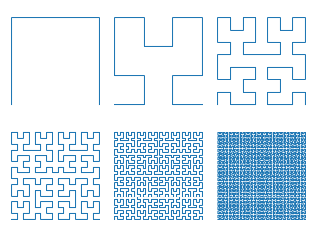

# Math fun

## akiyama_tanigawa.py

Akiyama Tanigawa Transform (and inverse)
```
Sequence: 1 1/2 1/3 1/4 1/5 1/6 1/7 1/8 1/9
Akiyama Tanigawa transform (Bernoulli numbers): 1 1/2 1/6 0 -1/30 0 1/42 0 -1/30
Inverse Transform: 1 1/2 1/3 1/4 1/5 1/6 1/7 1/8 1/9
```

## difference_table.py

`build_difference_table` builds difference table from a given sequence, `make_newton_polynomial` constracts Newton series polynomial from finite differences, which can be used to continue initial sequence.

```
1 4 9 16 25 36 49 64 81
3 5 7  9 11 13 15 17   
2 2 2  2  2  2  2      

Newton polynomial: 1 + 2x + x^2

Continuation: 121 144 169 196 225
```

## gaussian_elimination.py

Gaussian(-Jordan) Elimination

## hilbert.py
`iter_hilbert` iterate Hilbert curve coordinates by order, `xy2index` gets index of a curve point from its coordinates, `index2xy` coordinates from index.



## lindenmayer.py
Lindenmayer system iterator

```
Algae system:
0 A
1 AB
2 ABA
3 ABAAB
4 ABAABABA
5 ABAABABAABAAB
```

## number_wall

Number Wall construction as described in Fred Lunnon's article [The number-wall algorithm: an LFSR cookbook](https://cs.uwaterloo.ca/journals/JIS/VOL4/LUNNON/numbwall10.html) and illustrated by Mathologer in [Secrets of the lost number walls](https://www.youtube.com/watch?v=NO1_-qptr6c).

```
Number wall
0  0 0 0  0  0  0  0  0   0   0   0   0    0
1  1 1 1  1  1  1  1  1   1   1   1   1    1
1  1 2 4  7 13 24 44 81 149 274 504 927 1705
  -1 0 2 -3  1  4 -8  5   7 -20  18   9     
     1 1  1  1  1  1  1   1   1   1         
                       
Characteristic polynomial
1 + x + x^2 - x^3
```

## pade_approximant.py

Calculate Padé approximant P/Q coefficients from Taylor series coefficients.

```
Taylor for exp(x): 1 1 1/2 1/6 1/24
P: 12 6 1
Q: 12 -6 1
```
